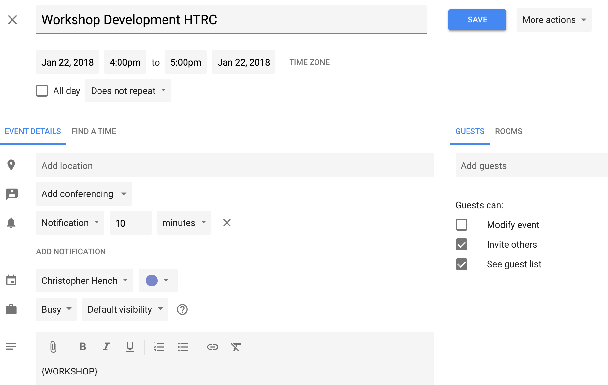

# Timesheet generator for Google Calendar

## How to setup

- Follow the instructions for steps 1 and 2 [here](https://developers.google.com/google-apps/calendar/quickstart/python).
- Place your `client_secret.json` file in the same directory as the `timesheet.py` script.
- Upon executing `python timesheet.py` for the first time, you will be asked to authenticate the application to your calendar. This will not be asked on subsequent executions.

## How to tag your events

- All you have to do is place the category of your event in between curly braces `{CATEGORY}` *in the description* part of the event.



## Generating your timesheet

There are two optional flags you can pass, `start` and `end`:

```bash
python timesheet.py --start="YYYY-MM-DD" --end="YYYY-MM-DD"
```

The default value for `start` is 2018-01-01. The default value of `end` is today's date.

## Timesheet format

Your timesheet will have the columns:

| Category  | Date  | Start Time | End Time | Title | Hours | Description |
|---|---|---|---|---|---|---|
